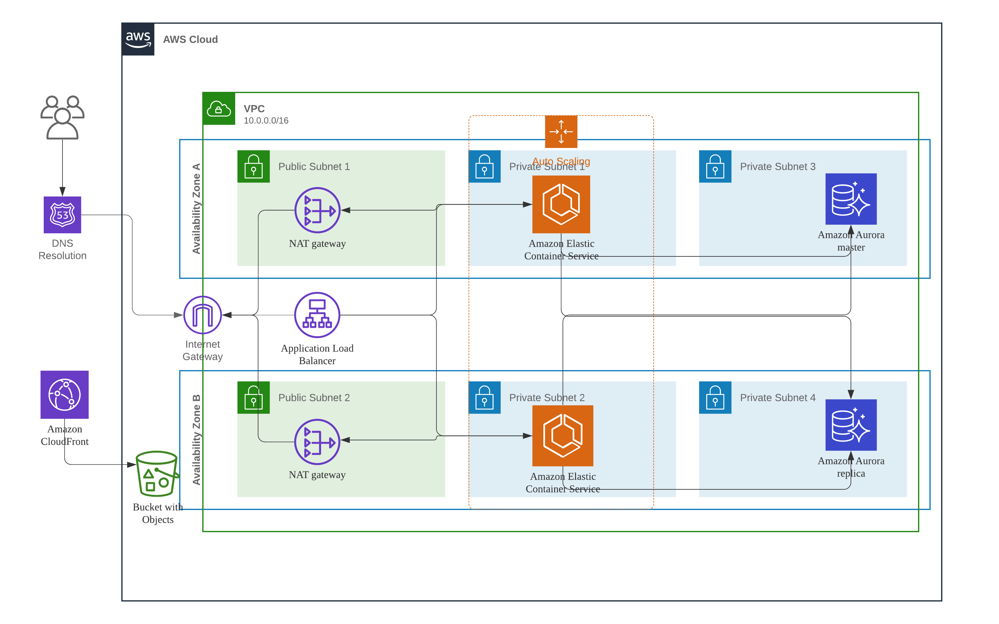

# Welcome to my project. It will setup an application with below resources.
* A codepipeline which will update itself
* Cloudfront distribution with S3 backend to store static content
* Application Load Balancer
* ECS cluster with EC2 instances
* Aurora mysql compatible databases
* VPC

## The application architecture is as below.


## You can customize the application by modify parameters in cdk.json
```
{
  "app": "npx ts-node bin/my-pipeline.ts",
  "context": {
    "@aws-cdk/core:enableStackNameDuplicates": "true",
    "aws-cdk:enableDiffNoFail": "true",
    "@aws-cdk/core:newStyleStackSynthesis": "true",
    "repoOwner": "JohnLiTangshan",
    "repo": "my-pipeline",
    
    "natGateways": 1, // How many nat Gateway
    "maxAzs": 2, // How many AZs
    "dbInstanceClass": "t2", // The database instance class
    "dbInstanceSize": "small", // The database instance size
    "dbMinCapacity": 1, // The minimum db instances
    "dbMaxCapacity": 3, // The maximum db instances
    "dbInstances": 2, // How many db instances to create
    "dbCpuTarget": 50, // The db autoscaling cpu target

    "appInstanceClass": "t2", // The EC2 instance class
    "appInstanceSize": "micro", // The EC2 instance size
    "instanceMinCapacity": 1, // The minimum ec2 instances
    "instanceMaxCapacity": 3, // The maximum ec2 instances
    "instanceDesiredCapacity": 1, // The desired capacity for autoscaling group
    "instanceAutoScalingTargetCpuUtilizationPercent": 60, // The autoscaling cpu target utilization

    "taskMemoryLimit": 512, // The ECS task memory limit
    "taskCpu": 256, // The ECS task cpu limit
    "taskDesiredCount": 1, // The ECS task desired count
    "taskMinCapacity": 1, // The ECS task minimum capacity
    "taskMaxCapacity": 3, // The ECS task maximum capacity
    "taskCpuTargetUtilizationPercent": 60 // The ECS task autoscaling target for cpu.

  }
}

```
## How to use this project.
* First run below command to bootstrap your environment, https://docs.aws.amazon.com/cdk/latest/guide/cdk_pipeline.html

```
set CDK_NEW_BOOTSTRAP=1 
npx cdk bootstrap --profile ADMIN-PROFILE ^
    --cloudformation-execution-policies arn:aws:iam::aws:policy/AdministratorAccess ^
    --trust PIPELINE-ACCOUNT-ID ^
    aws://ACCOUNT-ID/REGION
```
* Run cdk deploy

The `cdk.json` file tells the CDK Toolkit how to execute your app.

## Useful commands

 * `npm run build`   compile typescript to js
 * `npm run watch`   watch for changes and compile
 * `npm run test`    perform the jest unit tests
 * `cdk deploy`      deploy this stack to your default AWS account/region
 * `cdk diff`        compare deployed stack with current state
 * `cdk synth`       emits the synthesized CloudFormation template
